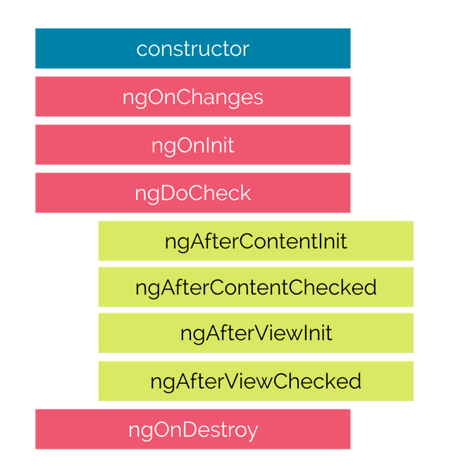

# Services and Dependency Injection

Services are used to organize and share business logic, modeles, data or functions with different components of an Angular Application

Each service is a singleton instance that can be injected into multiple components. Essentially creating reusable code

In Angular a service is a class that is used to share data across multiple components, and they live in a file with .services.ts extension

We use Dependency Injection to inject services into components of our application

Dependency Injection allows a class to receive its dependencies from an outside source, instead of creating them itself

- This helps decouple our code

The framework uses an Injector where we register all the dependencies to me managed, it is repsonisble for creating service instances and injectsing them into components

The Injector holds all the services, registers them with the NgModule or if otherwise specified wiht their provider
- The provider tells where it the application to register the service
- The registered services can be accessed via Depenency Injection token, which is a lookup key

## Creating/Using a service

To create a service use `ng g s name` this will create a name.service.ts file with the @Injectable decorator on the class

@Injectable marks a class as a service that can be injected
- The proviedIn property allows you to set the service class, it also declares where it can be used
- The Injector provides the single instance of our service
- A hierarchy of injectors at the NgModule and component level can provide different instances of a service to their own compoents and child components

# Component Lifecycle Methods

The life cycle of a Angular component is:

- Creation
- Render
- Create/Render Children
- Check for data changes
- Destroy before remove it from DOM

These events are called LifeCycle hooks, and these have 8 different function calls that correspond to the lifecycle event

**constructor** - The constructor of the component class gets executed first, before the execution of any other lifecycle hook. If we need to inject any dependencies into the compoent, then the constructor is the best place to do it

**ngOnChanges** - Called whenever the input properties of the component change. It returns _SimpleChanges_ object which holds any current and previous property values

**ngOnInit** - Called once to intialize the component and set the input properties. It initializes the component after Angular first displays the data-bound properties

**ngDoCheck** - Called during all change-detection tuns that Angular cant detect on its own. Also called immediately after the ngOnChanges method

**ngAfterContentInit** - Invoked once after Angular performs any content projection into the components view

**ngAfterContentChecked** - Invoked after each time Angular checks for content projected into the component, it is called after ngAfterContentInit, and every subsequent ngDoCheck

**ngAfterViewInit** - Invoked adter Angular initalizes the compoents view and its child views

**ngAfterViewChecked** - Invoked after each time Angular checks for content prjected into the component. It is called after ngAfterViewInit and every subsequent ngAfterContentChecked

**ngOnDestroy** - Invoked before Angular destroys the directive of component

# Pipes

Pipes provide a way to transform values in an Angular template, you can use the pipe symbol ( | ) and they can take almost any datatype and transform it

There are many built-in pipes in Angular:
- Date pipe: used to formatting dates
- Decimal pipe: used to formatting numbers
- Currency pipe: used for formatting currencies
- Percent pipe: used to formatting percent values
- Slice pipe: used for slicing string
- Lowecase pipe: used to convert strings to lowercase
- Uppercase pipe: used to convert strings to uppercase
- Titlecase: use to convert string to titlecase
- Json pipe: used for converting values into a json format
- Async pipe: used for unwrapping values from an asynchronous primitive

# Custom Pipes

Not only are their built-in pipes, you can also create your own

To create a custom pipe, use the CLI command `ng g pipe pipe-name`

This will create two files, a name.pipe.ts file, and a name.pipe.spec.ts file, to implement your pipe include your logic in the name.pipe.ts file

The name.pipe.ts file will have a class that implements PipeTransform, and you must implement the method transform from this interface