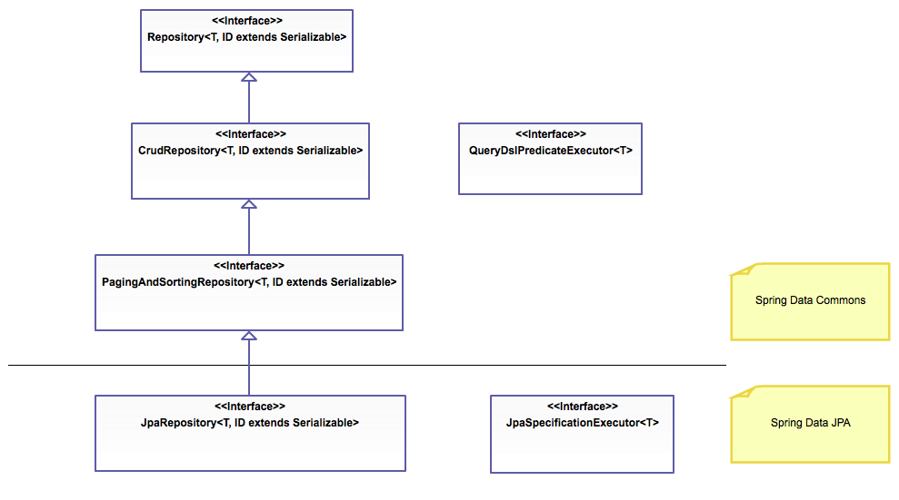

# Spring Boot

Spring Boot is an open source Spring Framework project used to rapidly create Java based, production grade application utilizing Spring Framework IOC and module intregations

Spring Boot simplifies the project creation because it allows you to pick and choose which Spring Frameworks you want to use, and configure said frameworks for you

Spring Boot has a built in Tomcat server, you dont have to map any servlets for web applications

To enable auto configuration you just need to annotate your driver class with @SpringBootApplication

- @SpringBootApplication is the combination of
    - @SpringBootConfiguration
    - @EnabledAutoConfiguration
    - @ComponentScan

You can also override/customize configurations using the application.properties file

# Spring Boot Devtools

Spring Boot DevTools implements two useful features

- Cache Disabling: cache is helpful in prodiction, but can hinder development workflow, DevTools automatically diables caching
- Automatic Restarts: anytime you make a change to your application, developement will server will restart automatically

# Lombok

Lombok is a java library that automatically plugs into your ide, spices up your Java. You will never have to write another getter, or equals method again, with one annotation your class has a fully featured builder, automate your logging variables and more

Lomboks goals are to reduce boilerplate code by generating it at runtime, this includes:
- Getters and Setters
- No arg constructors
- toString methods
- equals method
- hashcode method
- logging varibles

# Spring Data

## Spring Data is NOT a core Spring Framework

### It is family of frameworks for ORM and data persitence whos main purpose is to abstract away required code for data storage. Allows us to focuse on business logic

We are specifically learning Spring Data JPA

It essentially abstracts away the use of hibernate and SpringORM, simplifying your Data Access Layer and providing standard implementations for common DAO methods

This means you no longer have to implement these, they are simply provided for you by extending the JpaRepository

When you extend JpaRepositpry Spring will automatically create an implementation for your DAO, includes CRUD for standard data access, and custom queries based off of method signatures

## Spring Data JPA Interface Hierarchy

## Spring Data JPA Features

- Building sophisicated repositories based on Spring and JPA
- Support for QueryDSL predicates and type-safe JPA queries
    - This is less important/probably wont use
- Transparent auditing of Domain classes
- Pagination suport
- Dynamic Query Execution
- Suport for ingregation of custom data access code
- Automatic custom queries
- Validation of @Query annotated queries during bootstrapping
- Suport for XML based entity mapping
- JavaConfig based repository configuration by introducing `@EnableJpaRepositories`

## Spring Data JPA Methods

- Comes with predefined methods
-   https://docs.spring.io/spring-data/jpa/docs/current/api/org/springframework/data/jpa/repository/JpaRepository.html
- Primarily Crud operations

- You can also create custom method signatures to find almost anything you want:
-   https://docs.spring.io/spring-data/jpa/docs/1.5.0.RELEASE/reference/html/jpa.repositories.html
- Take a look at table 2.3 in about link for above examples
- When Spring Data creates a new Repository Implementation, it analyzes all of the methods defined in the interface, and attempts to automatically generate queries from method name. It has limitations, but it is also very powerful and elegant way of defining new custom access methods with little effort

- You can also use @Query to write JPA queries, and use QueryDSL as stated above
    - You may end up using @Query on rare occasions

## Spring Data Annotations

A quick run down of the different Spring Data Annotations

| Annotation                      | Purpose                                                                                   |
| ------------------------------- | ----------------------------------------------------------------------------------------- |
| @Transactional                  | Configure how the database transaction behaves              |
| @NoRepositoryBean               | Creates an interface that provides common methods for child repositories                  |
| @Param                          | Parameters can be passed to queries defined with @Query                                   |
| @Transient                      | Mark a field as transient, to be ignored by the data store engine during reads and writes |
| @CreatedBy, @LastModifiedBy     | Auditing annotations that will automatically be filled with the current principal         |
| @CreatedDate, @LastModifiedDate | Auditing annotations that will automatically fill with current date                       |
| @Query                          | Supply a JPQL query for repository methods                                                |